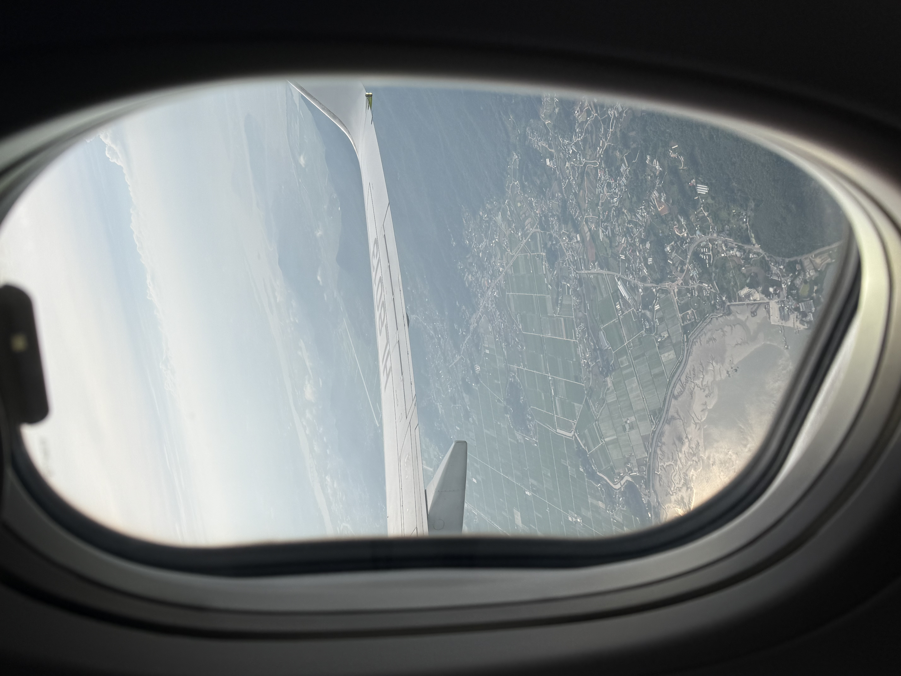
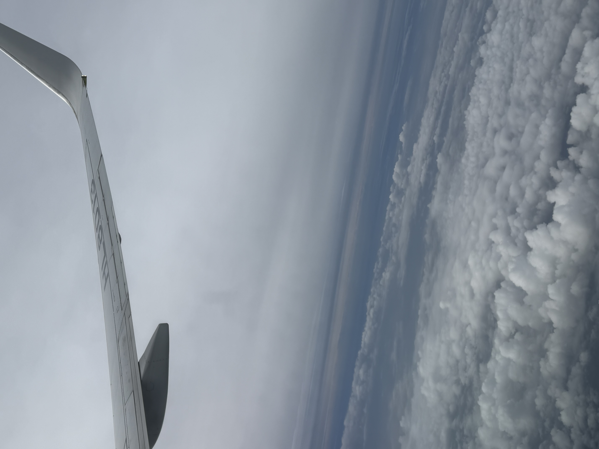
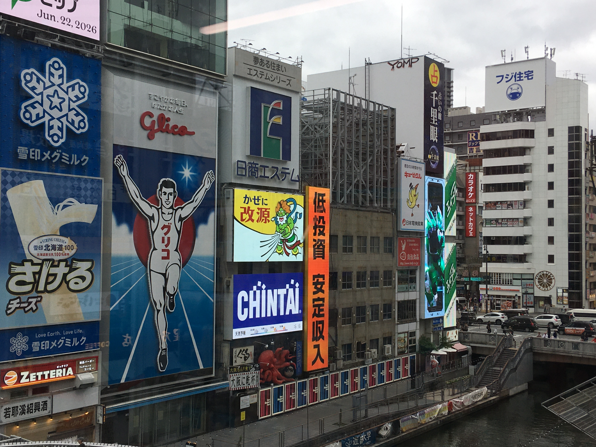
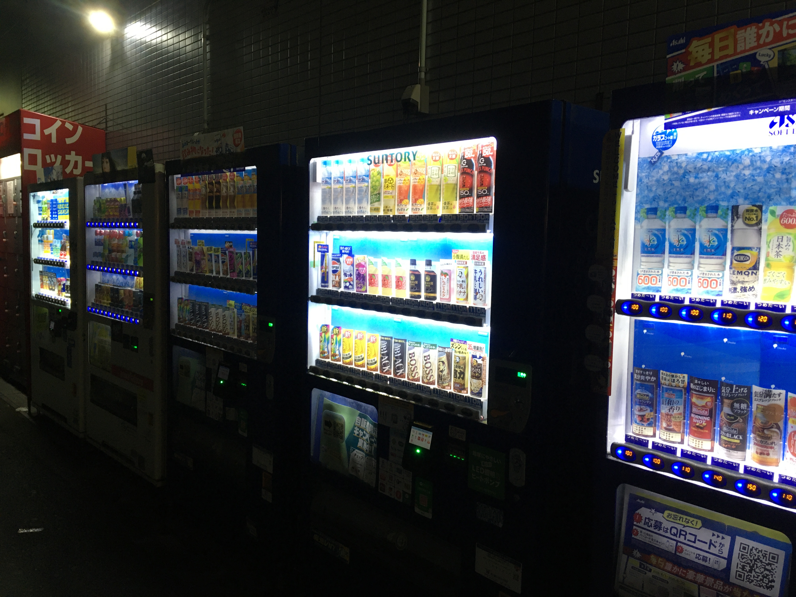
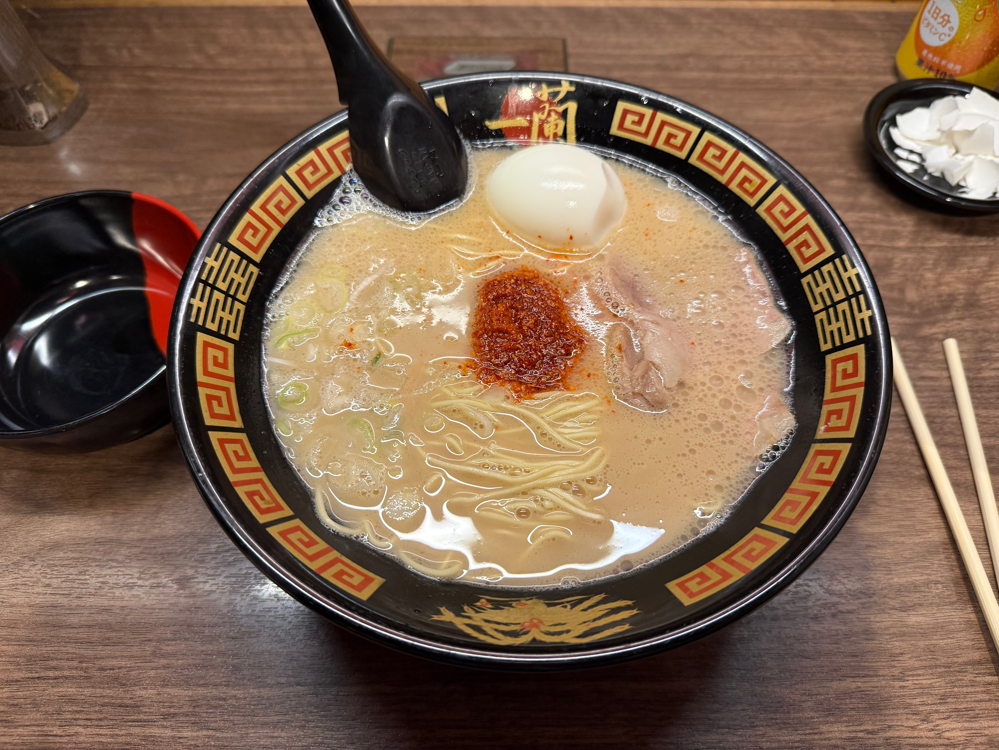
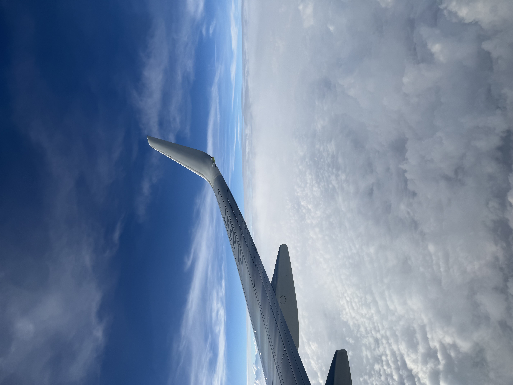

# 6월 1일

6월 새로운 마음으로 일기를 써보겠습니다.  
종강하고 남은 하반기는 알차게 살아야징..

# 6월 9일

기말고사 히히 망했다!

# 6월 14일

내일 시험 하나만 보면 종강!!!!

# 6월 15일

종강이다! 오늘은 푹 쉬어야지.

# 6월 21일

헤헤 내일 여행가요. 벌써 신난다 두근두근!!

# 6월 22일

일찍 일어나야해서 힘들었다.. 하지만 너무 재밌을 것 같아 설렌다!
비행기를 타면 항상 사진을 찍는다.  
날이 흐려서 구름이 정말 많았다. 그래도 위에서 보니까 예쁘더라!

도착하자마자 짐 놓고 바로 돌아다녔다.  
여기가 바로 유명한 관광지!!!

# 6월 23일

오늘도 하루 종일 돌아다녔다.  
여긴 자판기가 거리에 진짜 많더라. 근데 뭔가 분위기 있고 예쁨!!

# 6월 24일

맛있당.

# 6월 25일

벌써 집 가는 날 ㅠㅠ  
며칠 안 있었는데 시간이 너무 빨리 갔다.
돌아올 때도 날이 흐렸는데, 갈 때 봤던 구름보다 더 예뻤음!

